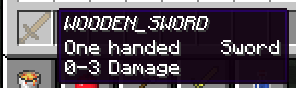
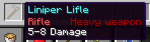
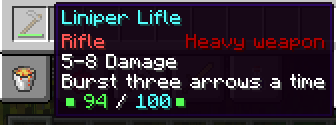

# 入门教程

RPGItems 插件拥有高度的可自定义性，使用它可以创建出各式各样的武器、防具、道具等等。也正因如此，RPGItems 插件需要一定的时间来熟悉它的使用方式。首先，我们从制作一件枪支型武器开始，逐步了解插件的基本使用方式。

## 创建物品

* 使用 `/rpgitem liniper_lifle create` 创建一个新的物品，它的 ID 为 `liniper_lifle` 。
* 使用 `/rpgitem liniper_lifle give` 获得一份该物品。  新创建的物品默认为木剑，如下图。



* 使用 `/rpgitem liniper_lifle item stone_hoe` 将物品的外形改为石锄。  注意，此时手中的物品外形也被修改为了石锄。由于 RPGItems 插件的物品更新策略，每当对一件物品进行修改，服务器中的**所有该物品都将同步更新**，这包括玩家背包中、玩家的箱子和末影箱中、其它插件提供的额外背包中等等。 
* 使用 ``/rpgitem liniper_lifle display `&bLiniper Lifle``` 修改物品的名称为 `Liniper Lifle`

  
  在 RPGItems 插件中，所有的显示文本均支持颜色代码 `&`。如果显示文本中需要包含空格，则需要使用反引号 ````` 将文本括起。  
  注意，在修改名称后，手中物品的名称没有被更新。出于物品可以被例如 NyaaUtils 等插件重命名的考虑，在更新物品时仅有名称不会被更新。重新获得一份该物品后，新物品的名称为修改后的名称。  

* 使用 `/rpgitem liniper_lifle hand &cRifle` 修改名称下一行左方的信息。使用 ``/rpgitem liniper_lifle type `&4Heavy weapon``` 修改名称下一行右方的信息。  这两处信息仅作为显示，没有具体的作用。 
* 最后，使用 `/rpgitem liniper_lifle damage 5 8` 将它的伤害值设置为 5-8 点。



## 添加技能

在 RPGItems 中，物品的所有效果几乎都由**技能**来控制。下面我们将为这个物品添加一个技能，使它能够射出箭矢。

* 使用 `/rpgitem liniper_lifle power projectile cooldown:10 isCone:false projectileType:arrow` 为物品添加 projectile 技能，使右键使用物品能够射出箭矢。箭矢的伤害为 5-8 点，即之前设置的物品伤害。两次射击间的冷却时间为 **10 tick**。isCone 设置为 false 表示箭矢没有散射角。  projectile 技能具有众多的参数。通过**命令补全**可以很方便地看到所有的参数列表。这些参数一部分为必要参数，另一部分为可选参数。这些参数可以在添加技能时设置，也可以在添加后通过 `/rpgitem set` 指令进行设置。 
* 使用 `/rpgitem liniper_lifle set projectile 1 speed 4` 将 projectile 技能中 speed 参数设置为 4 。这使箭矢的飞行速度变为 4 。
* 使用 `/rpgitem liniper_lifle set projectile 1 burstCount 3` 将 projectile 技能中 burstCount 参数设置为 3 。这使箭矢能够连射 3 发 。
* 使用 `/rpgitem liniper_lifle set projectile 1 triggers LEFT_CLICK` 将 projectile 的触发设置为左键，此时射出箭矢的按键改为左键。  
  
  在 RPGItems 中，所有的技能均具有**触发**。触发可以是按键，动作，或者是事件。只有在对应的触发下，技能才能够被使用。  
  
  并不是所有的技能都支持全部的触发。一些技能由于使用方式限制，仅能使用部分触发。常用的触发有：  


  * LEFT\_CLICK 左键
  * RIGHT\_CLICK 右键
  * SNEAK 进入潜行状态
  * SPRINT 进入疾跑状态
  * TICK 在每个游戏刻触发
  * HIT 攻击命中时触发
  * HURT/HIT\_TAKEN 受伤时触发

  
  各个触发的机制详见 [触发详解](advanced.md#chu-fa-xiang-jie)。  

## 添加描述文本

RPGItems 支持自由修改物品的描述文本。

* 使用 `/rpgitem liniper_lifle togglepowerlore` 隐藏技能描述文本。
* 使用 ``/rpgitem liniper_lifle description add `Burst three arrows a time``` 为物品添加一行描述文本。  除此之外，还可以使用 `description set [行数] [内容]` 来修改某一行的内容，`description insert [行数] [内容]` 在某一行前插入内容，`description remove [行数]` 来删除某一行。注意，行数从 0 开始计数。

## 添加耐久值

RPGItems 使用**独立的耐久系统**。从耐久值的增减到物品的损毁，均由插件进行完全地控制。原版的各种方式（如附魔、铁砧修复）均无法影响它的耐久值。下面我们将在插件中为物品添加耐久消耗。

* 对所有新创建的物品，默认的最大耐久为 -1 ，此时物品处于不可破坏状态。使用  `/rpgitem liniper_lifle durability 100` 将其最大耐久和初始耐久设置为 100 。
* 使用 `/rpgitem liniper_lifle durability bound 0 100` 将其耐久上下限设置为 100 和 0 。  耐久值的上下限会限制物品耐久在使用中可能达到的范围。当物品耐久值为 0 时，物品就会损毁。如果该物品存在堆叠，那么堆叠的所有物品都将损毁。 
* 使用 `/rpgitem liniper_lifle set projectile 1 cost 1` 将 projectile 技能的消耗设置为 1 点，使得每次射击都会消耗 1 点耐久值。  对于 RPGItems 物品，耐久值几乎都是通过触发技能进行消耗。大部分的技能都具有 cost 这一属性，表示触发该技能时应消耗的耐久值。 
* 使用 `/rpgitem liniper_lifle togglebar` 将耐久条显示在物品界面。
* 使用 `/rpgitem liniper_lifle barformat NUMERIC` 将耐久条显示改为数字模式。  配置文件中的 numeric\_bar 和 force\_bar 选项可以改变耐久条的默认显示方案。



关于耐久条的进阶使用方法，请参照 [耐久的特殊使用](advanced.md#nai-jiu-de-te-shu-shi-yong) 。

## 完善攻击效果

目前的物品已经拥有了射击的基本功能，但它在攻击效果上还不够完善。

* 使用 `/rpgitem liniper_lifle power rangedonly` 使其只能通过远程方式造成伤害。  如果不取消近战攻击的伤害，会使得该武器在左键近战攻击时也能造成伤害。 
* 使用 `/rpgitem liniper_lifle power noimmutabletick` 取消攻击目标受伤后的无敌时间。  如果不取消其无敌时间，目标在受到伤害后会进入 10 tick 的无敌时间。这也意味着该武器的三连发只有第一发能造成伤害。取消了无敌时间后，它的每一发都能造成 5-8 点伤害。

更多此方面的内容请参照 [伤害与攻击方式管理](advanced.md#shang-hai-yu-gong-ji-fang-shi-guan-li) 。

